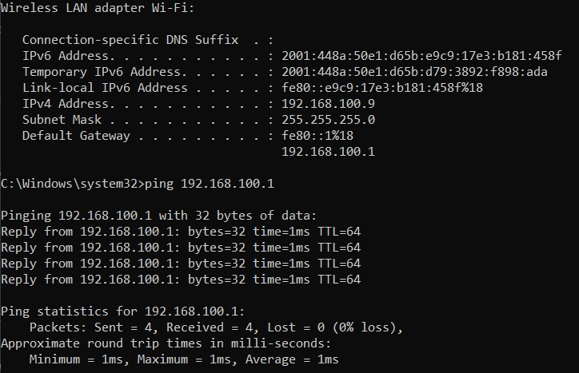
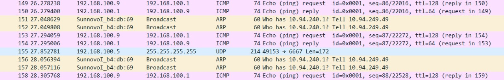
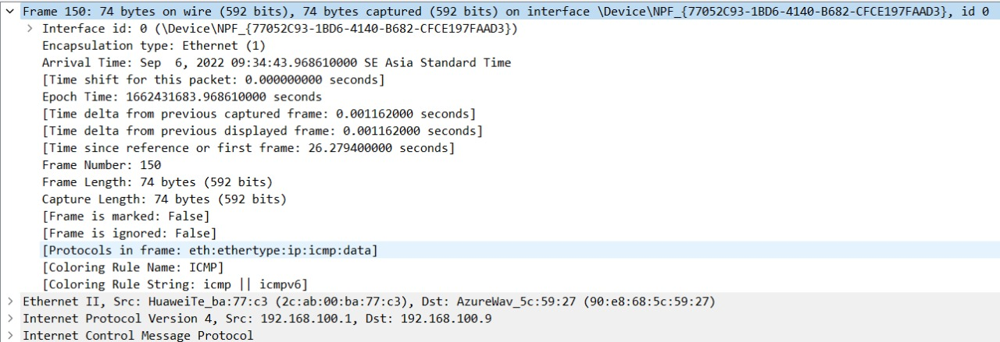
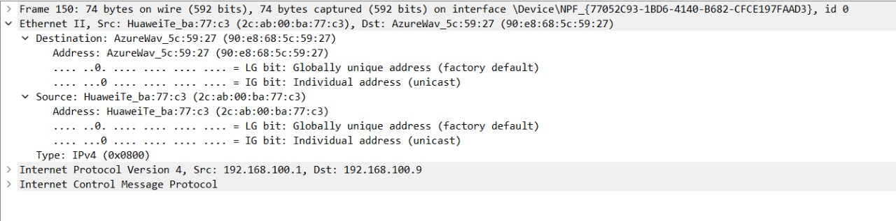
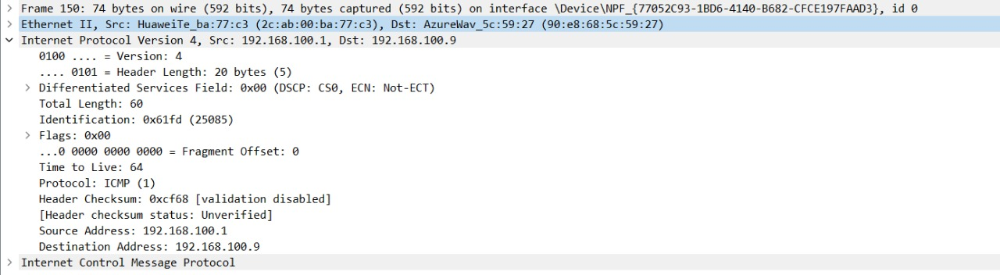
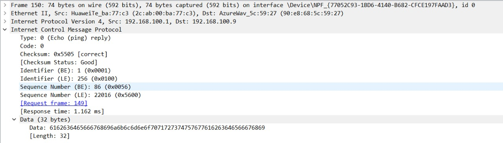

# Documentation Task Wireshark
## Color Rules
Wireshark menggunakan warna untuk mengidentifikasi jenis warna yang terlihat sekilas oleh kita. secara default, hijau merupakan lalu lintas dari TCP, Biru tua merupakan lalu lintas DNS, Biru muda merupakan lalu lintas dari UDP, dan Hitam merupakan pengindentifikasian dari paket TCP.

| Warna dari WireShark  | Packet Type |
| :-------------------: | :---------------:|
| Light Purple          | TCP |
| Light Blue | UDP |
| Black |  Packets with errors |
| Light Green | HTTP Trasffic |
| Light Yellow | Windows-Specific traffic including Server Message Blocks (SMB) and NetBIOS |
| Dark Yellow | Routing |
|Dark Gray | TCP SYN, FIN and ACK traffic |
| Red | Invalid Display Filter |
||

Contoh Warna dalam Wireshark :

## Cek Ip Address, Default Gateway, dan PING

Pada laptop saya, terdeteksi IP laptop yaitu 192.168.100.9 dan Default Gateway saya yaitu 192.168.100.1

## Packet Analyzer

Dapat kita ketahui bahwa IP Address saya pada ethernet yakni 192.168.100.9 dan default gatewaynya adalah 192.168.100.1 kita bisa melihat hal tersebut pada wireshark. Di setiap paket terdapat headernya

### Frame 

Dalam lapisan frame terdapat:
- Arival Time : Sep , 2022 09:34:43.968610000 SE Asia Standard Time menunjukkan waktu saat pengiriman data
- [Time delta from previous captured frame: 0.001162000 seconds], [Time delta from previous displayed frame: 0.001162000 seconds], dan [Time since reference or first frame: 26.279400000 seconds] menunjukkan waktu sebelum capture dari frame, waktu setelah frame ditampilkan, dan juga waktu sejak awal frame.
- Frame Number: 150 menunjukkan nomor dari frame tersebut
- Frame Length: 74 bytes (592 bits) menunjukkan panjangnya frame dalam bentuk byte
- [Protocols in frame: eth:ethertype:ip:icmp:data] menunjukan protokol apa saja yang ada dalam satu frame.
- ::: Pada lapisan frame ini memiliki beberapa lapisan protokol seperti ethernet, IP, TCP, HTTP, dan data.

## Ethernet II

Dalam lapisan Ethernet terdapat :
- Source : HuaweiTe_ba:77:c3 (2c:ab:00:ba:77:c3), Destination: AzureWav_5c:59:27 (90:e8:68:5c:59:27) yang mana ini menunjukkan MAC dari source dan MAC dari destination
- ::: Lapisan ini merupakan lapisan data link MAC dari source dan destination.

## Internet Protocol V4

Dalam lapisan Internet Protocol V4 terdapat :
- 0100 . . . . = Version 4
- . . . . 0101 = Header Length : 20 bytes(5) menunjukkan panjang header
- Internet Source Address: 192.168.100.1 menunjukkan IP source, Destination Address: 192.168.100.9 menunjukkan IP destination
- ::: Lapisan ini merupakan lapisan network yang memiliki panjang 20 bytes dan memiliki IP source serta IP destination

## ICMP (Internet Control Message Protocol)

Dalam lapisan ICMP terdapat :
- terdapat type, code, checksum, identifier(BE/LE), Sequence Number (BE/LE) seperti pada gambar diatas
- [Request frame: 149 / Responsice time: 1.2] Dari data ICMP diatas saat echo ping request yang mana ICMP memiliki typem, code, dengan algoritma checksum dll menunjukan hasil saat request ping yang berasal dari paket dari source IP address dari komputer kita yang merequest ping ke destination.