# PRATIKUM KONSEP JARINGAN
# Laporan Packet Tracer

Pada laporan kali ini, saya mengamati bagaimana sebuah jaringan berjalan pada komputer/pc. Laporan ini terdapat 3 Skenario yaitu PC1 ngeping PC2 (awal), PC1 ngeping PC2, dan PC2 ngeping PC1.

Pertama kita menghubungkan PC terlebih dahulu pada apk Packet Tracer, kemudian set IP pada setiap PC

Setelah IP pada setiap pc sudah diberikan maka masuk ke Skenario yang akan di bahas.

## Skenario 1, PC0 ke PC1
- Pertama check arp dan ping PC1 pada cmd PC0
 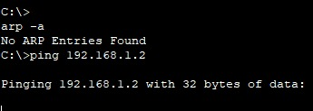
- Setelah ngeping maka akan ada massage seperti ini
  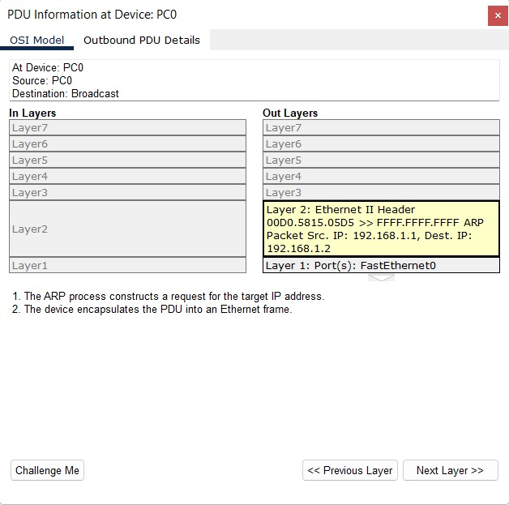
  Dikarenakan MAC IP Address destination tidak ditemukan maka proses encapsulasi pada layer 2. Sehingga PC0 mengirim broadcast yang berisi paket arp yang disebarkan ke semua MAC
  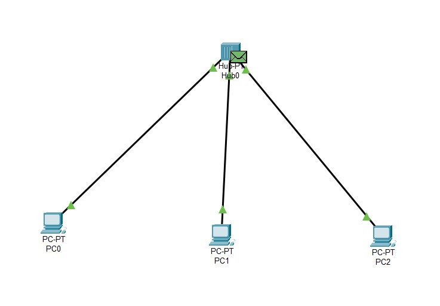
  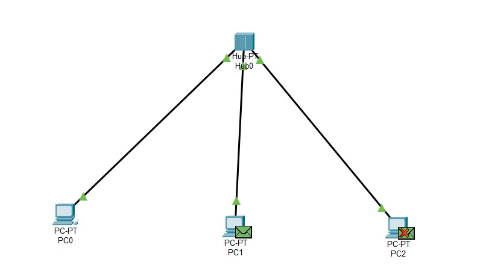
  Setelah disebarkan ke MAC, ternyata ada kesamaan pada MAC1
- Setelah terdapat kesamaan, maka isi dari paket arp diisikan oleh MAC IP destination yang akan dikembalikan pada MAC0
  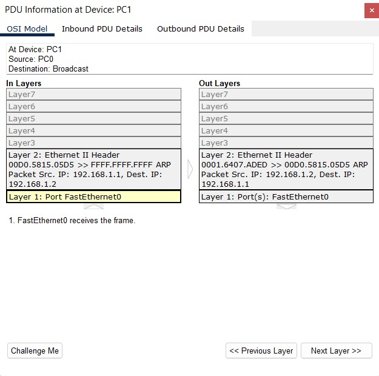
  
  
- Kemudian diganti alamat yang sebelumnya FFFF.FFFF.FFFF menjadi alamat MAC1
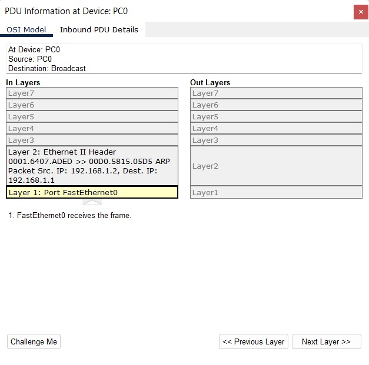

- Setelah melakukan ping, ketika di test arp maka MAC1 akan tersimpan

## Skenario 2, PC0 ke PC1
- Pertama check arp dan ping PC1 pada cmd PC0
  
- Setelah ngeping maka akan ada massage seperti ini
  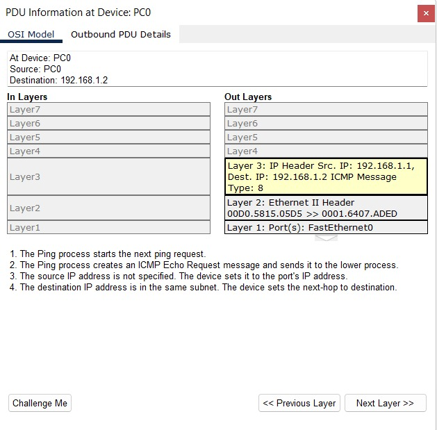
  Sama seperti skenario 1, namun kali ini tidak melakukan broadcast lagi karena syarat encapsulasi pada layer ke-2 sudah terpenuhi yaitu MAC IP address destination.
  
  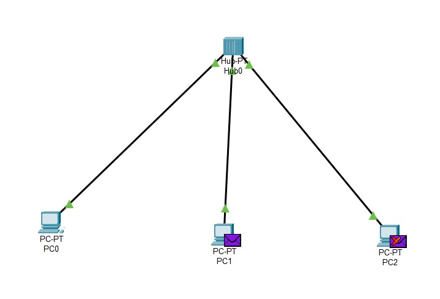
  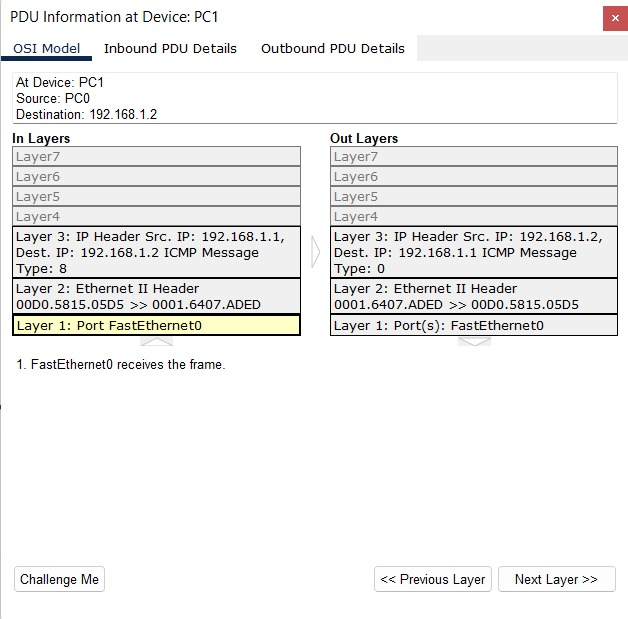
  Terdapat kesamaan dalam PC1 dengan MAC IP addres destination, kemudian dikembalikan ke alamat utama dan diterima pada PC0
  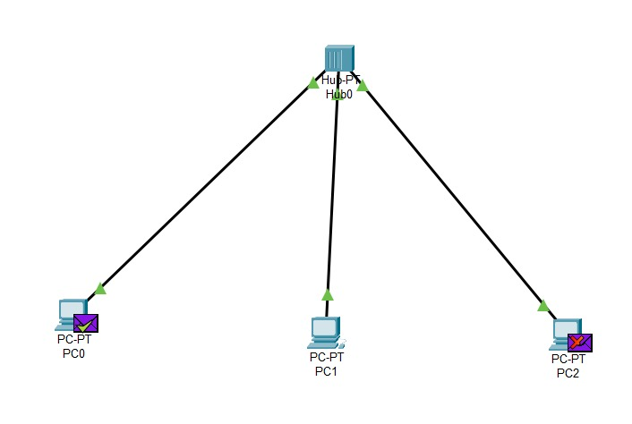
  

- Apakah proses ping ini harus melakukan broadcast lagi ?
  Tidak terjadi broadcast karena IP pada MAC1 sudah disimpan pada arp MAC0

## Skenario 3, PC1 ke PC0
- Pertama check arp dan ping PC0 pada cmd PC1
  
- Ketika sudah melakukan pratikum ternyata skenario 3 sama seperti skenario 2 pada penjelasannya
  
  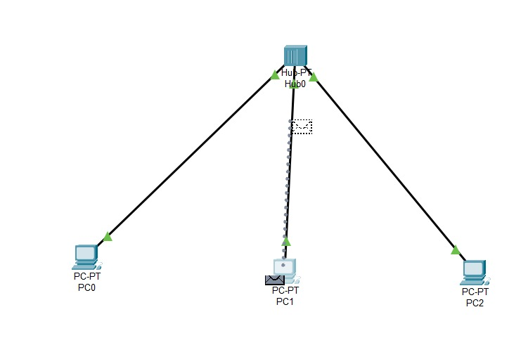
  
  
  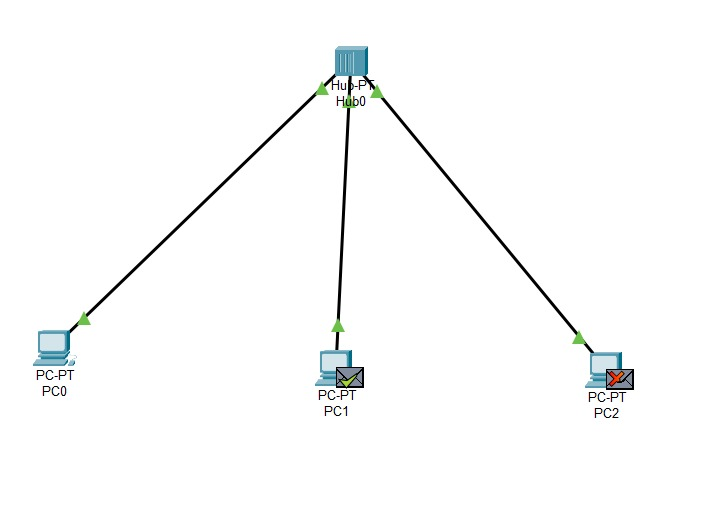
  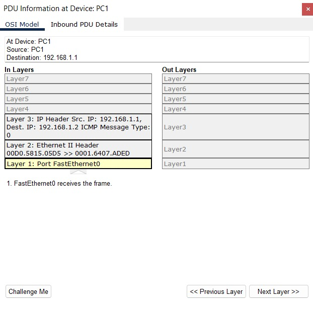

- Apakah proses ping ini harus melakukan broadcast lagi ?
  Tidak terjadi broadcast karena IP pada MAC0 sudah disimpan pada arp MAC1 pada saat awal melakukan broadcast.