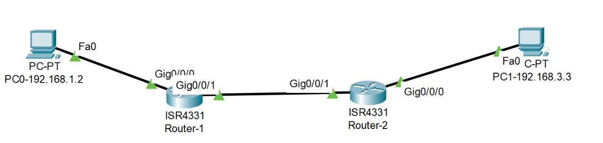
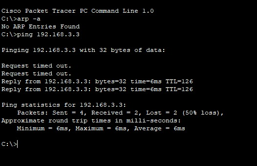
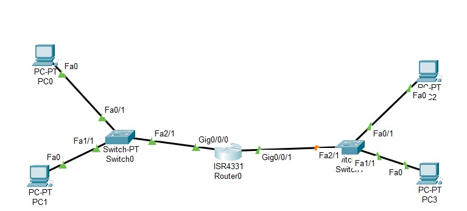
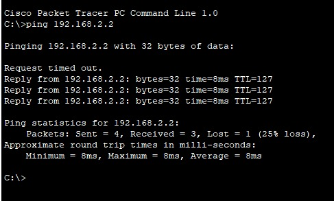

# Pratikum Konsep Jaringan
# Static Routing

kali ini saya akan melakukan pratikum tentang Static Routing tapi sebelum itu saya akan menjelaskan apa itu Routing, IP address pada layer 3.

## Routing
Routing adalah suatu metode dari jaringan yang berfungsi untuk mencari rute yang belum ada maupun mencari rute terbaik dari sebuah jalur yang sudah ada. Pada routing sendiri memiliki suatu tabel yang mana berisikan tentang address destination maupun menentukan jalur terbaik menuju destination.
Terdapat 2 jenis routing pada layer 3 :
1. Static Routing 
2. Dynamic Routing

Perbedaan antara keduannya cukup sederhana yaitu terdapat perbedaan pada tata cara tabel routingnya, Static dengan cara kita menginputkan destinationnya sendiri dan Dynamic  secara automatis.

## IP Address
Pada layer 3 IP Address bisa disebut juga logical address. IP Address terdiri dari 32 bit angka biner untuk IPv4 dan 128 untuk IPv6, keduanya mempunyai kesamaan yaitu pada network address dan juga host address. 
IPv4 memiliki 32 bit yang mana dibagi menjadi 4 ruang oktet yang mana setiap oktet berisi 8 bit angka biner yang dibagi lagi menjadi beberapa class:
1. Class A =  1  - 126 binery bit
2. Class B = 128 - 191 binery bit
3. Class C = 192 - 223 binery bit
4. Class D = 224 - 239 binery bit
5. Class E = 240 - 254 binary bit
6. untuk binary bit 255 berguna untuk broadcast.

## Percobaan 1 -  Static Routing
Pertama buat pc dan router seperti gambar dibawah ini:

kemudian setting pada setiap perangkat sesuaikan pada tabel dibawah:

|Perangkat|Interface|IP Addess|Gateway|
|---------|---------|---------|-------|
|PC0      |fa0      |192.168.1.2|192.168.1.1|
|PC1      |fa0      |192.168.3.3|192.168.3.2|
|Router0  |Gig0/0   |192.168.1.1| |
|         |Gig0/1   |192.168.2.1| |
|Router1  |Gig0/0   |192.168.3.2| |
|         |Gig0/1   |192.168.2.2| |

setelah itu setting untuk konfigurasi statcinya pada setiap router yang berguna untuk menentukan rute yang bisa dilalui pada router
1. router 0
   ketik ip route 192.168.3.0 255.255.255.0 192.168.2.2 pada CLI router 0
2. router 1
   ketik ip route 192.168.1.0 255.255.255.0 192.168.2.1 pada CLI router 1

Setelah semua selesai kemudian ping pada cmd di PC0 dengan tujuan IP PC1 maka akan muncul seperti gambar dibawah ini :

Pada gambar diatas, akan terjadi RTO sebanyak 2 kali dikarenakan PC0 belum mengetahui IP destination sehingga terjadi broadcast.

## Percobaan 2
Pertama buat 4 model pc, 2 switch dan sebuah router seperti gambar dibawah ini:

kemudian setting ip pada setiap perangkat sesuaikan pada tabel dibawah:
|Perangkat|Interface|IP Addess|Gateway|
|---------|---------|---------|-------|
|PC0      |fa0      |192.168.1.2|192.168.1.1|
|PC1      |fa0      |192.168.1.3|192.168.1.1|
|PC2      |fa0      |192.168.2.2|192.168.2.1|
|PC3      |fa0      |192.168.2.3|192.168.2.1|
|Router0  |Gig0/0   |192.168.1.1| |
|         |Gig0/1   |192.168.2.1| |

### ping PC0 > PC2

Setelah menjalankan ping, akan terdapat RTO sekali yang dimaksudkan untuk broadcast ke semua IP MAC yang mana ketika sudah ditemukan maka keduanya akan menyimpan IP Address yang sesuai dengan broadcastnya. contoh PC0 ke PC2 akan mengalami broadcast terlebih dahulu karena MAC IP Address belum ditemukan, ketika sudah ditemukan maka PC0 akan menyiman IP address PC2 dan PC2 menyiman IP addres PC0.