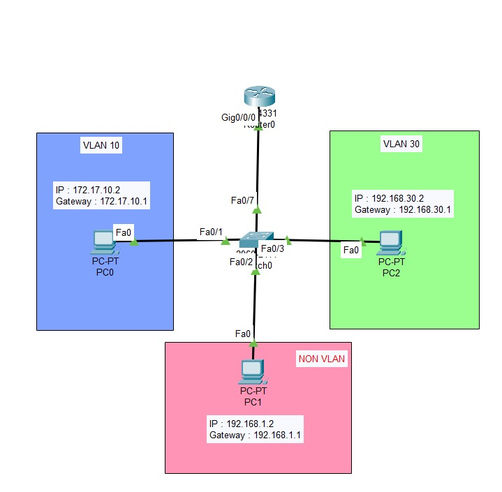
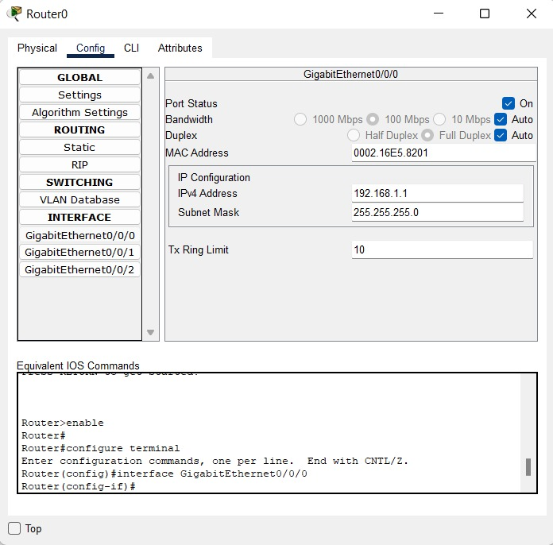
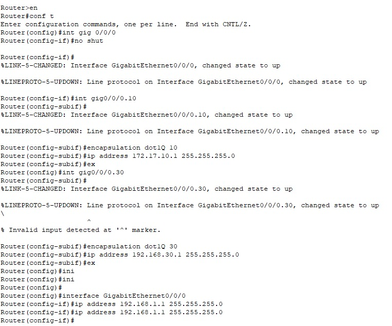
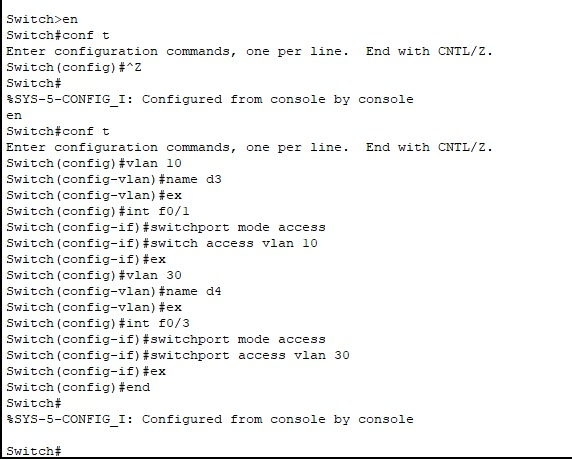
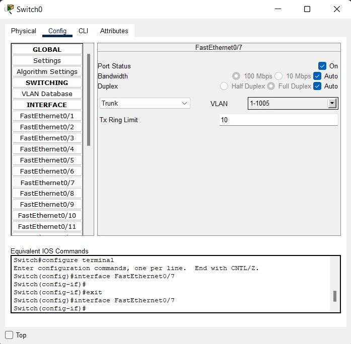
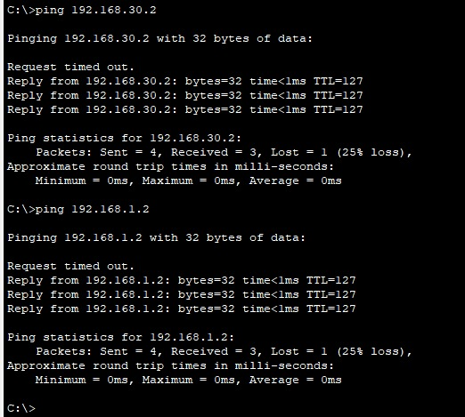

# LAPORAN PRATIKUM KONSEP JARINGAN
# VLAN

## Pengertian
Virtual Local Area Network atau yang biasa disebut dengan VLAN adalah sebuah subnetwork yang mengelompokkan kumpulan perangkat pada jaringan LAN yang terpisah dan berguna untuk menghindari keterbatasan fisik dari kabel LAN yang memungkinkan skala jaringan dan segmentasi yang mana meningkatkan keamanan dan mengurangin adanya latensi jaringan.

VLAN ini memiliki fungsi untuk mengakodomir konfigurasi pada jaringan komputer menjadi beberapa domain siaran. namun jalur yang dihasilkan VLAN masih melewati perangkat penghubugn yang sama sehingga biasanya dikonfigurasi dengan mikrotik atau cisco.

## Tugas Pratikum
Terdapat 1 router, 1 switch dan beberapa pc client dengan pembagian menggunakan VLAN-10, VLAN-30, dan juga Non-VLAN. seperti gambar dibawah ini :

### Configurasi IP (MAC)
|Perangkat|Interface|IP Addess|Gateway|
|---------|---------|---------|-------|
|PC0      |fa0      |172.17.10.2|172.17.10.1|
|PC1      |fa0      |192.168.1.2|192.168.1.1|
|PC2      |fa0      |192.168.30.2|192.168.30.1|

### Configurasi Router
- Untuk Non VLAN menkonfigurasikan secara manual pada GigabitEthernet0/0/0 kemudian masukkan IPV4 dengan menggunakan IP Gateway

- Sementara itu untuk VLAN 10 maupun 30 menkonfigurasi pada CLI masukan sesuai pada gambar dibawah ini

### Configurasi Switch
- Untuk konfigurasi VLAN 10 dan VLAN 30 menggunakan CLI dengan memasukkan sesuai pada gambar dibawah ini :
  
- sementara untuk non-VLAN hanya mengubah FastEthernet dari Access ke Trunk pada switch yang terhubung ke router
  

### Test ping antara sesama VLAN dan Non-VLAN

Keduanya akan terjadi RTO sekali. Saya melakukan ping pada sesama VLAN pada PC dengan memiliki IP network yang berbeda dan subnetting tanpa bantuan routing static karena pada router akan terjadi direcly connected karena telah dikonfigurasi yang mana menghubungkan antara keduanya melalui VLAN sehingga tidak diperlukan routing static, VLAN seolah terdapat 2 kabel pada router IP yang berbeda tetapi dengan menambahkan IP pada virutal di interface yang terkoneksi pada router secara nyata. namun pada Non-VLAN kita harus menkofigurasi secara manual pada setiap jalur yang akan dilewati yaitu router dan switch serta mengubah mode pada switch yang mengarah ke router dari Access ke Trunk.

